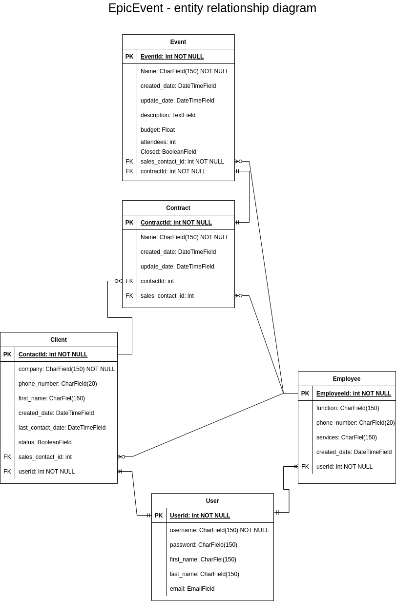

# openclassroom - projet11 - application with Flask

| EpicEvents |
|:----------:|

_Owner: [Amélie](https://github.com/ameliebnpp)_

## Developpement guide

### General informations

This project is developped with :
- Python(programming language),
- Django(web framework),
- Django REST(REST API framework),
- PostgreSQL(database)
- Postman(test API)

### DataBase conception

Using [diagrams.net](https://www.diagrams.net/), database is reprented as below : 
- User: all information regarding a user
- Client: potentiel or converted client
- Employee: group employee by function
- Contract: signed by client to organize an event
- Event: all event informations



### Installation

1. Clone the project:

```bash
git clone --recursive git@github.com:amelieBNPP/epicevents.git
```
*Clone only one time the project.*

2. Active the virtual environement:
```bash
python3 -m venv env
source env/bin/activate
```
*The virtual environement is created only one time, however, it is activate each time we start to develop.*

### Dependencies

Install dependencies :

```bash
pip install -r requirements.txt
```
*Install dependancies each time we develop on this project.*

### Run server

Server can be run using the following commands:
```bash
python manage.py runserver
```

The API can be tested in local at the following adresse : http://127.0.0.1:8000/

### Sources

Starting with django : https://docs.djangoproject.com/fr/4.0/intro/tutorial01/
Connexion with PostgreSQL : https://docs.djangoproject.com/fr/4.0/ref/databases/#postgresql-notes