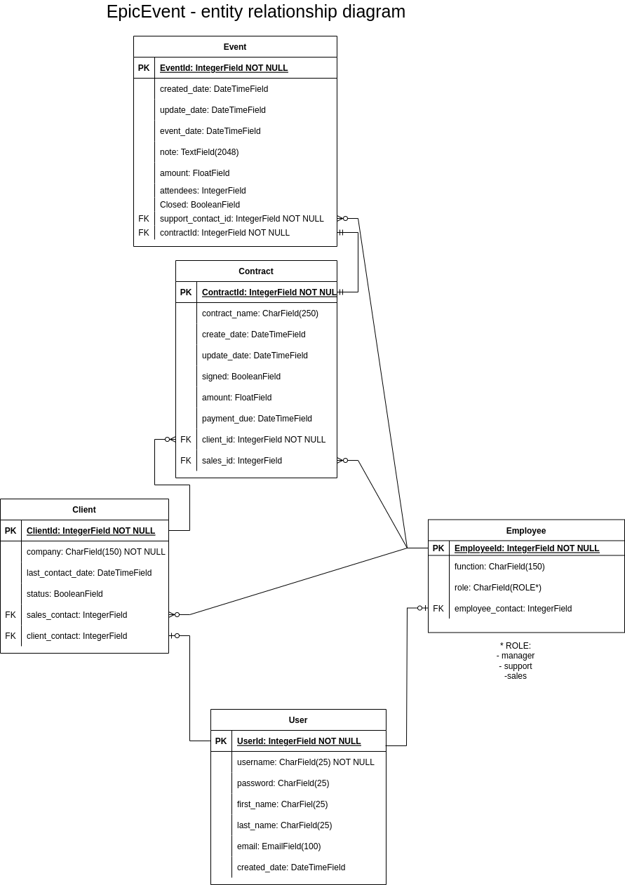
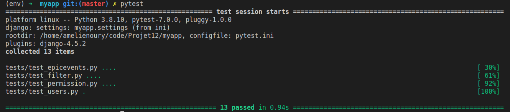

# openclassroom - projet 12 - CRM

| EpicEvents |
|:----------:|

_Owner: [Amélie](https://github.com/ameliebnpp)_

## Developpement guide

### General informations

This project is developped with :
- Python(programming language),
- Django(web framework),
- Django REST(REST API framework),
- PostgreSQL(database)
- Postman(test API)

### DataBase conception

Using [diagrams.net](https://www.diagrams.net/), database is reprented as below : 
- User: all information regarding a user
- Client: potentiel or converted client
- Employee: group employee by function
- Contract: signed by client to organize an event
- Event: all event informations



### Installation

1. Clone the project:

```bash
git clone --recursive git@github.com:amelieBNPP/epicevents.git
```
*Clone only one time the project.*

2. Active the virtual environement:
```bash
python3 -m venv env
source env/bin/activate
```
*The virtual environement is created only one time, however, it is activate each time we start to develop.*

### Dependencies

Install dependencies :

```bash
pip install -r requirements.txt
```

*Install dependancies each time we develop on this project.*

### Run server

Server can be run using the following commands:
```bash
python manage.py runserver
```

The API can be tested in local at the following adresse : http://127.0.0.1:8000/

### Admin

Create a superUser in `manage.py` directory : 
```bash
python manage.py createsuperuser
```

### FRONTEND

Django Administration will be used as a simple frontend : 
- launch server
- run : `http://127.0.0.1:8000/admin/`
- connect with your supersUser identifiers

### Endpoints and filters

From postman, endpoints can be tested with the following routes : 

Create user with
```bash
http://127.0.0.1:8000/user/signup/
http://127.0.0.1:8000/user/login/
http://127.0.0.1:8000/user/user/
```

create Employee with
```bash
http://127.0.0.1:8000/epicevents/employees/
http://127.0.0.1:8000/epicevents/employees/?role=sales
```

create Client with
```bash
http://127.0.0.1:8000/epicevents/clients/
http://127.0.0.1:8000/epicevents/clients/?sort_by=compagny_name
```

create Contract with
```bash
http://127.0.0.1:8000/epicevents/contracts/
http://127.0.0.1:8000/epicevents/clients/<client pk>/contracts/
http://127.0.0.1:8000/epicevents/clients/9/contracts/?min_amount=10000&max_amount=25000
```

create Event with
```bash
http://127.0.0.1:8000/epicevents/event/
http://127.0.0.1:8000/epicevents/clients/<client pk>/contracts/<contract pk>/events/
http://127.0.0.1:8000/epicevents/clients/<client pk>/contracts/<contract pk>/events?min_attendees=100&max_attendees=200
```

All details are sumup in [postman documentation](https://documenter.getpostman.com/view/14836417/UyrHdsws).
### Permissions

In the aim to improve security, permissions is set:
- manager GET/PUT/POST/DELETE client/employee/contract/event
- sales GET/PUT/POST/DELETE client/contract/event for which the sales is working, GET otherwise
- support GET/PUT/POST/DELETE event for which the sales is working, GET otherwise

### Test

Launch tests
To ensure new features do not add any regression in the code, run the tests with the following commands :
```bash
pytest
```

### Logging

In order to configure logging, you use LOGGING in settings.
A file with all Warning, error, critical will be report in a `debug.log` file at the root of the project.
```bash
[09/May/2022 14:15:57,629] Unauthorized: /user/login/
[09/May/2022 14:15:57] "POST /user/login/ HTTP/1.1" 401 32
[09/May/2022 14:18:26,284] Not Found: /
[09/May/2022 14:18:26] "GET / HTTP/1.1" 404 2274
[09/May/2022 14:20:25,299] Forbidden: /epicevents/employees/1/
[09/May/2022 14:20:25] "DELETE /epicevents/employees/1/ HTTP/1.1" 403 63
```

### Sources

Starting with django : https://docs.djangoproject.com/fr/4.0/intro/tutorial01/
Connexion with PostgreSQL : https://dev.to/jkaylight/django-rest-framework-with-postgresql-a-crud-tutorial-1l34
Pytest : https://pytest-django.readthedocs.io/en/latest/helpers.html#client-django-test-client
Configuring logging : https://docs.djangoproject.com/en/4.0/topics/logging/#configuring-logging